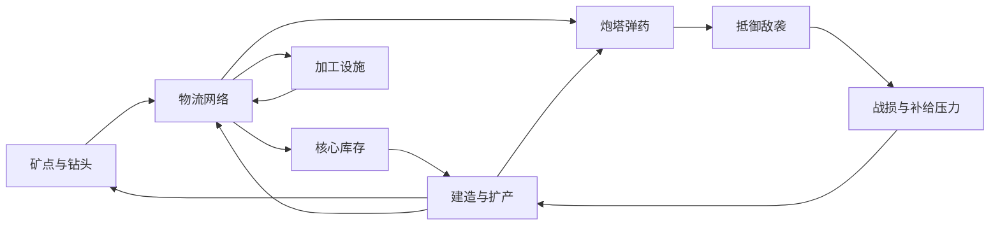

# Mindustry 玩法代码分析与 Cocos 实现参考

分析日期：2026-09-22。代码基线：本仓库 `f4f0ff6a65`。本文基于本地源码静态分析，不代表其他版本，也不包含本轮实际运行或真人试玩结论。

本文从玩家决策出发解释规则，再指向实现入口。重点是当前 Cocos 项目相关的采集、物流、生产、建造和防守；电力、液体、单位及战役作为扩展机制概览。文中的“设计推论”和“建议”不是源码直接保证的体验结论。

配套文档：[重构方案](01-重构方案.md)、[开发进度](03-开发进度.md)、[可玩性纠偏](04-T15可玩性纠偏.md)。本文补充原版机制依据，不改变这些文档的范围和验收状态。

## 1. 核心玩法：在敌袭压力下维护生产网络

Mindustry 的主要循环是：选矿点 → 建立采集与运输 → 将资源分配给建设、加工和弹药 → 布置防线 → 应对波次和战损 → 扩产或调整布局。

同一种铜既是建设材料，也能成为炮塔弹药。因此“现在多造一座炮塔”与“持续给已有炮塔供弹”会争夺资源。更先进的材料还能改善弹药效果，但要求额外生产设施和运输空间。



设计推论：地图中的矿点位置、可建设空间、运输距离和敌人路线共同决定布局价值。如果资源直接进入全局库存、炮塔远程扣库存，玩家就不再需要保护和调整供给线。

## 2. 代码怎样组织玩法

以下链接均相对本文位置指向仓库源码。阅读时应同时看“具体内容参数”和“通用行为类”，仅看其中一处容易误判规则。

| 层次 | 代码入口 | 负责的规则 |
| --- | --- | --- |
| 内容定义 | [Blocks.java](../../core/src/mindustry/content/Blocks.java)、[Items.java](../../core/src/mindustry/content/Items.java)、[UnitTypes.java](../../core/src/mindustry/content/UnitTypes.java) | 建筑费用、配方、弹药映射、单位属性 |
| 地图与放置 | [World.java](../../core/src/mindustry/core/World.java)、[Tile.java](../../core/src/mindustry/world/Tile.java)、[Build.java](../../core/src/mindustry/world/Build.java) | 地形、矿层、建筑占用、放置合法性 |
| 建筑公共行为 | [BuildingComp.java](../../core/src/mindustry/entities/comp/BuildingComp.java) | 库存收发、消耗效率、邻接关系与建筑更新 |
| 建筑专有行为 | [Drill.java](../../core/src/mindustry/world/blocks/production/Drill.java)、[Conveyor.java](../../core/src/mindustry/world/blocks/distribution/Conveyor.java)、[Turret.java](../../core/src/mindustry/world/blocks/defense/turrets/Turret.java) | 采矿、带上物品运动、瞄准与射击 |
| 全局规则 | [Rules.java](../../core/src/mindustry/game/Rules.java)、[Logic.java](../../core/src/mindustry/core/Logic.java) | 波次时间、模式、资源及战斗倍率、胜负 |
| 敌人生成与行动 | [WaveSpawner.java](../../core/src/mindustry/ai/WaveSpawner.java)、[GroundAI.java](../../core/src/mindustry/ai/types/GroundAI.java)、[Pathfinder.java](../../core/src/mindustry/ai/Pathfinder.java) | 刷怪、移动目标与路径代价 |

`Block` 描述建筑类型，具体 `…Build` 保存每座建筑的运行状态。`mindustry.gen` 中的类由构建生成；追踪公共行为应回到 `entities/comp`，不要手改生成类。

许多时间参数使用以 60 为每秒基准的时间单位，并通过 `Time.delta`、`delta()`、`edelta()` 推进；它们不应直接当成秒，也不意味着游戏只能以固定 60 FPS 运行。`edelta()` 还包含效率影响。迁移到 Cocos 固定 tick 时需要明确换算。

## 3. 建造与核心：资源支出本身也是决策

### 3.1 放置和施工是两个阶段

[Build.java](../../core/src/mindustry/world/Build.java) 的 `validPlace` / `validPlaceIgnoreUnits` 检查放置条件，`beginPlace` 创建施工状态。[ConstructBlock.java](../../core/src/mindustry/world/blocks/ConstructBlock.java) 的 `construct` 根据进度、核心材料与规则倍率推进施工并扣料；`deconstruct` 按拆除进度及 `deconstructRefundMultiplier` 等规则返还建材。

因此，原版常规建造不等于“一次扣费、瞬间完成”。材料不足会限制施工进度，施工单位的建造能力也参与过程。放置限制还包括建筑尺寸、地形、已有建筑、单位重叠和核心附近的规则，不能仅判断目标格为空。

设计推论：建造时间让战中补防存在响应成本；拆除退款降低试错成本，但不应把主动拆除与敌人摧毁视为同一种经济事件。

### 3.2 核心库存和局部库存不同

[CoreBlock.java](../../core/src/mindustry/world/blocks/storage/CoreBlock.java) 的 `onProximityUpdate` 会处理同队核心的共享库存及相邻可链接仓储扩容。[StorageBlock.java](../../core/src/mindustry/world/blocks/storage/StorageBlock.java) 通过 `linkedCore` 区分链接仓储和独立仓储。

不能把所有仓库都理解为自动接入全局建材池，也不能说原版仓库永远独立。核心接收上限、满仓处理还受 `coreIncinerates` 等规则影响。

Cocos 首版的即时建造、独立仓库可以保留，但应作为明确的简化。UI 中要区分“能用于建造的核心库存”“在线运输的物品”“设备内部缓存”。

## 4. 采矿：矿点覆盖与出口共同决定产量

[Drill.java](../../core/src/mindustry/world/blocks/production/Drill.java) 中的关键方法为 `canMine`、`countOre`、`getDrillTime`、`DrillBuild.updateTile`。

1. 钻头检查占地范围内可采矿物；矿物硬度、钻头等级及特殊限制影响能否开采。
2. `countOre` 选择一种主产物，并记录该矿物的有效覆盖格数。排序涉及矿物低优先级标记、数量和 ID，不是同时开采覆盖到的全部矿种。
3. 采矿延迟由基础 `drillTime`、矿物硬度及矿物倍率决定。
4. 进度受覆盖数量、效率、预热及可选液体增益影响。
5. 达到产出条件后尝试卸料；内部库存满时不能持续生产，堵塞会向上游传递。

在无液体增益、效率为 1、预热稳定、时间倍率为 1、出口畅通的前提下，可用以下近似估算：

```text
单件采矿延迟 = (drillTime + hardnessDrillMultiplier × 硬度) / 对应矿物倍率
每秒产量 ≈ 60 × 有效矿格数 / 单件采矿延迟
```

当前机械钻头在 `Blocks.java` 中为 2×2、12 铜建造、`drillTime=600`；默认硬度系数为 50，铜硬度为 1。覆盖四格铜且无特殊倍率时，稳定产量约为 `60×4/650=0.369 铜/秒`。这是上述条件下的推算，启动预热、堵塞或加速会改变实测值。

设计推论：同一种钻头放在不同位置会产生不同收益。Cocos 如果采用单格、固定速率钻头，仍可通过近矿与远矿、运输距离和暴露程度提供取舍，不必首版就复制全部采矿参数。

## 5. 物流：方向、容量、吞吐与堵塞

### 5.1 接收协议

[BuildingComp.java](../../core/src/mindustry/entities/comp/BuildingComp.java) 的 `acceptItem` 判断是否可收，`handleItem` 更新接收端状态；`dump` 尝试转出已有库存，`offload` 优先寻找可接收邻居，否则进入自身库存。具体建筑可以覆盖这些行为。

这意味着建筑靠在一起并不保证物品流通：物品类型、容量、方向和队伍等条件都会参与判断。生产、运输和消费必须共享一致的收发规则。

### 5.2 三种基础运输建筑

| 建筑 | 源码机制 | 玩家可见结果 |
| --- | --- | --- |
| [Conveyor](../../core/src/mindustry/world/blocks/distribution/Conveyor.java) | 保存物品类型和带上位置，容量为 3；移动受前方物品间距及下一段带的入口空间限制；侧向接入条件不同 | 下游堵塞后逐段排队，带的方向和侧接位置影响输入 |
| [Router](../../core/src/mindustry/world/blocks/distribution/Router.java) | 普通常规接收时只暂存一件，按物品记录轮转位置，寻找能接收的邻居 | 分配由出口可用性决定，不能保证所有出口永久均分 |
| [Junction](../../core/src/mindustry/world/blocks/distribution/Junction.java) | 各方向使用独立缓冲，满足通过延迟后向对应前方输出 | 交叉运输不等于四向混流，下游拒收会阻塞该方向 |

路由器的 `getTileTarget` 只有特定回流例外，不能概括为“永远不送回输入方向”。普通传送带 `speed=0.035` 是内部运动参数，界面使用另设的 `displayedSpeed=5`；不要直接把前者乘 60 当作每秒物品吞吐量。

设计推论：物流的难点不仅是连通，还包括谁先得到货、哪里缓存、哪里会堵。延长单条线路主要增加运输延迟和在线库存，稳定吞吐则受瓶颈限制。

Cocos 验收应关注：拒收时物品留在发送端、每件物品不会在同一步无限跨格、分流结果可解释、拆毁线路后的损失可追踪。无需照搬原版逐建筑更新方式，可以沿用当前分阶段运输实现。

## 6. 加工：配方可用不等于持续满产

[GenericCrafter.java](../../core/src/mindustry/world/blocks/production/GenericCrafter.java) 的 `shouldConsume` 检查输出空间等条件；`updateTile` 在有效率时推进进度；`craft` 触发消耗并产出物品；`dumpOutputs` 尝试持续卸出产品。

公共消耗逻辑在 [BuildingComp.java](../../core/src/mindustry/entities/comp/BuildingComp.java) 的 `updateConsumption`：必要消费者的效率约束共同决定建筑能否有效运行，可选消费者另行处理。不能把所有机器归纳为“有原料就按固定速度工作”。此外，通用工厂的物品在批次完成时触发消耗，而液体输出可以按进度连续发生。

原版石墨压缩机在 `Blocks.java` 中消耗 2 煤、产出 1 石墨，`craftTime=90`，无需在该定义中接入电力。在效率为 1、无加速且输入输出畅通时：

```text
加工周期 = 90/60 = 1.5 秒
满产煤需求 = 2/1.5 ≈ 1.333 煤/秒
满产石墨输出 = 1/1.5 ≈ 0.667 石墨/秒
```

设计推论：升级生产链时，玩家要比较收益与上游供给成本；增加工厂数量不保证总产量提高。界面最好区分缺原料、缺电、输出满和手动禁用，而不是统一显示“未工作”。

## 7. 防守：弹药供给限定持续火力

### 7.1 物品与弹药单位不是一比一

[ItemTurret.java](../../core/src/mindustry/world/blocks/defense/turrets/ItemTurret.java) 的 `handleItem` 将物品按对应子弹的 `ammoMultiplier` 转换为弹药单位，`acceptItem` 据此检查总弹药容量。[Turret.java](../../core/src/mindustry/world/blocks/defense/turrets/Turret.java) 的 `useAmmo` 再按 `ammoPerShot` 扣除。

炮塔还需要找目标、旋转、满足射击条件、完成装填。`findTarget`、`updateReload`、`updateShooting` 和 `shoot` 分别负责这些阶段。冷却液、弹种装填倍率、射击模式和控制状态都可能影响实际射击节奏。

当前 Duo 定义可用于理解升级弹药的价值：

| 弹药物品 | 单发基础伤害 | 每件转换弹药量 | 其他差异 |
| --- | --- | --- | --- |
| 铜 | 9 | 2 | 基础弹种 |
| 石墨 | 18 | 4 | `reloadMultiplier=0.8`，`rangeChange=16` |
| 硅 | 12 | 5 | `reloadMultiplier=1.5`，带追踪参数 |

这些是内容定义，不是最终 DPS；伤害和射击还受规则倍率、命中率、目标护甲及其他机制影响。

### 7.2 用一组供需计算说明扩产价值

Duo 的基础 `reload=20`。假设铜弹、每次一发、每发耗 1 弹药单位、持续有目标、无冷却或速度增益，则理论上限为每秒 3 发，持续需求为每秒 1.5 铜。

与第 4 节的机械钻头例子比较：四台四格铜钻头约提供 `1.477 铜/秒`，略低于该持续需求；五台约 `1.846 铜/秒`，在运输可达的前提下才有余量。这不是推荐的关卡固定配比：敌人间歇到来时，炮塔缓存可以提前积累，实际需求也可能低于持续射击上限。

设计推论：增加第二座炮塔会提高短时爆发和覆盖，但若共用的矿线已经不足，长期输出仍受总供给限制。可以用以下关系排查布局：

```text
可持续射速 ≤ min(炮塔装填上限, 实际送达物品速率 × 每物品弹药量 / 每发耗弹)
```

### 7.3 命中、伤害和敌人属性

[BulletType.java](../../core/src/mindustry/entities/bullet/BulletType.java) 定义命中实体与建筑、范围伤害、穿透等行为；[ShieldComp.java](../../core/src/mindustry/entities/comp/ShieldComp.java) 与 [Damage.java](../../core/src/mindustry/entities/Damage.java) 处理单位护甲等伤害规则。射出子弹不能直接视为造成伤害。

设计推论：快速敌人考验覆盖和命中，耐久敌人考验持续伤害，范围伤害适合密集目标。墙不仅延迟敌人，也可能保护供弹线路；若炮塔打不到墙前敌人，单纯堆墙未必有效。

## 8. 敌人移动：墙会改变代价，不应形成无解封路

[GroundAI.java](../../core/src/mindustry/ai/types/GroundAI.java) 的 `updateMovement` 会寻找敌方核心，接近核心时设置攻击目标，否则使用核心路径场；还包含卡住检测和相应处理。

[Pathfinder.java](../../core/src/mindustry/ai/Pathfinder.java) 按队伍、移动类型及目标类型维护路径场。普通地面代价包含建筑生命、邻近障碍、液体和危险地面等因素；某些地形或己方不可通行建筑是硬阻挡，敌方可攻击建筑可以体现为有限代价。这里的建筑生命参与路径权重，并不是精确模拟摧毁耗时。

不能据此推断所有单位都使用同一套地面路线。飞行、腿部、海军等移动方式有不同规则，攻击目标选择也不只由路径模块决定。

Cocos 首版可以保留“共享距离场 + 有限破坏代价 + 挡路攻击”，重点检验建筑变化后路径更新、完全封路时的进攻行为，以及多敌人拥堵。不要把玩家建筑全部设为不可达，否则容易产生堵死入口即可永胜的问题。

## 9. 波次和胜负：计时与清场是不同条件

[SpawnGroup.java](../../core/src/mindustry/game/SpawnGroup.java) 用起止波、波间隔、基础数量、数量增长与上限等计算该组当波出兵量；还可以配置护盾增长等属性。[Waves.java](../../core/src/mindustry/game/Waves.java) 提供波次内容和生成逻辑；实际生成由 [WaveSpawner.java](../../core/src/mindustry/ai/WaveSpawner.java) 执行。

`WaveSpawner` 使用 `state.wave - 1` 查询组数据；`Logic.runWave` 先触发生成，再增加 `state.wave` 并重设计时。因此展示波号、组定义索引和胜利阈值必须一起看，不能直接把一个索引复制到另一套调度器。

[Logic.java](../../core/src/mindustry/core/Logic.java) 的关键行为：

- 波次计时开启且未结束游戏时，倒计时按条件减少。
- `isWaitingWave` 在启用 `waitEnemies`，或达到指定胜利波阈值且仍有敌人时，阻止继续倒计时。
- 因此常规规则并不保证每波都在上波清场后才开始计时，敌人可能叠加。
- 非战役生存胜利要求满足波次条件、敌人数为零、刷怪过程结束；玩家核心全部消失会触发失败。
- 攻击模式按阵营存活及核心条件另行判定；战役通常通过占领区块处理阶段完成，还可从守波切换到攻击模式，不能统一为普通关卡结算。

设计推论：波次强度来自数量、类型、护盾、出生点及重叠压力。仅增加敌人生命可能延长等待，却不产生新的布局决策。

## 10. 扩展玩法概览

以下仅说明系统作用与阅读入口，不是全部建筑与例外规则清单。

| 系统 | 实现入口与主要机制 | 对玩法的作用 / Cocos 取舍 |
| --- | --- | --- |
| 电力 | [PowerGraph.java](../../core/src/mindustry/world/blocks/power/PowerGraph.java) 的 `update` 汇总供需，短缺时使用电池、富余时充电，再分配供电 | 形成跨设备依赖和共同故障点；现有首版范围不要求引入 |
| 液体 | [Conduit.java](../../core/src/mindustry/world/blocks/liquid/Conduit.java)、[BuildingComp.java](../../core/src/mindustry/entities/comp/BuildingComp.java) 的液体收发，以及消费者配置 | 可作为必需原料、钻头增益或炮塔冷却；不能统一看成可选加速 |
| 单位生产 | [UnitFactory.java](../../core/src/mindustry/world/blocks/units/UnitFactory.java) 按计划推进生产，完成后消耗材料并创建单位载荷；[Reconstructor.java](../../core/src/mindustry/world/blocks/units/Reconstructor.java) 负责升级链 | 把经济转成机动力量和进攻能力；会增加指挥与寻路复杂度 |
| 科技研究 | [TechTree.java](../../core/src/mindustry/content/TechTree.java)、[ResearchDialog.java](../../core/src/mindustry/ui/dialogs/ResearchDialog.java) | 技术节点、资源投入和目标共同约束解锁；不等于每局自动升级 |
| 战役区块 | [SectorInfo.java](../../core/src/mindustry/game/SectorInfo.java)、[Universe.java](../../core/src/mindustry/game/Universe.java)、[SectorPresets.java](../../core/src/mindustry/content/SectorPresets.java) | 记录区块生产、输入输出和战役推进；比线性关卡多一层持续经济 |
| 星球差异 | [SerpuloTechTree.java](../../core/src/mindustry/content/SerpuloTechTree.java)、[ErekirTechTree.java](../../core/src/mindustry/content/ErekirTechTree.java)、[Planets.java](../../core/src/mindustry/content/Planets.java) | 科技内容、资源及规则不同；本文铜线案例不是所有星球的通用开局 |

逻辑处理器、蓝图、多人和 Mod 不在本次重点机制分析范围内，也不因列出扩展系统而自动加入 Cocos 开发计划。

## 11. 对照当前 Cocos 代码，哪些属于主动简化

当前实现应以代码为准，历史开发记录可能描述较早行为。以下仅列已核对的代表差异，不作完整功能验收。

| 项目 | 原版机制 | 当前 Cocos 对照 |
| --- | --- | --- |
| 内容参数 | `Blocks.java` 配置各类建筑 | [Content.ts](../../cocos/assets/scripts/domain/Content.ts) 独立定义费用、容量、生命；钻头 8 铜、普通炮塔 12 铜，不是原版数值 |
| 采矿 | 覆盖格数、硬度、预热、效率等共同决定 | [World.ts](../../cocos/assets/scripts/domain/World.ts) 的 `step` 中钻头累计 20 tick 产出一件，缓存满则停止推进 |
| 加工 | 通用工厂完成批次时触发物品消耗 | `World.updateCrafter` 开始批次即取走两件煤，40 tick 后尝试产出，输出缓存限制后续生产 |
| 准备期经济 | 原版核心接收逻辑不使用本项目的累计入库字段 | `World.preparationRemaining` 读取 `preparation.deliveryLimit`，是小游戏专用约束 |
| 波次间隔 | `Logic` 计时与 `waitEnemies` 等规则共同控制 | [WaveScheduler.ts](../../cocos/assets/scripts/domain/WaveScheduler.ts) 的下一波延迟从上一波最后一次出生开始，并非从清场开始 |
| 更新编排 | 全局更新配合实体与建筑自身逻辑 | [GameSession.ts](../../cocos/assets/scripts/application/GameSession.ts) 编排世界、刷怪、敌人、战斗及结算；[SimulationClock.ts](../../cocos/assets/scripts/application/SimulationClock.ts) 管理逻辑时间 |
| 路径与战斗 | 多移动方式、多弹种和复杂伤害系统 | [DistanceField.ts](../../cocos/assets/scripts/domain/DistanceField.ts)、[EnemySystem.ts](../../cocos/assets/scripts/domain/EnemySystem.ts)、[CombatSystem.ts](../../cocos/assets/scripts/domain/CombatSystem.ts) 实现精选规则 |

这些差异不必全部消除。判断依据是：简化之后，玩家是否仍需做有后果的资源分配与布局选择，并能看懂结果。

## 12. 后续关卡和规则验证建议

以下是基于机制的设计建议，不代表本轮已通过测试或需要立即扩展范围。

| 决策问题 | 应出现的可观察差异 | 验证方式 |
| --- | --- | --- |
| 扩产还是加炮 | 供给受限时，加炮改善爆发但不能无限提高持续输出 | 对比同矿线单炮/双炮，以及增加矿线后的送达量和射击数 |
| 近矿还是远矿 | 近矿成本低；远矿带来产能、独立供给或更好炮位，但线路更长 | 比较总建材、首批到货时间、战损与最终核心生命 |
| 分流还是专线 | 分流节约线路，专线降低多个消费者相互争抢 | 记录各出口实际接收量、空弹时长及堵塞位置 |
| 加工还是直接用原料 | 升级收益需要覆盖加工建设和持续输入成本 | 对比相同经济投入下的有效伤害，而非只比较单发伤害 |
| 缓存是否提供补救机会 | 断线后先消耗已有弹药，修好后恢复射击 | 从真实缓存开始计时，分别验证修复和不修复结果 |
| 墙是否有价值 | 墙在炮塔可覆盖位置争取时间，敌人仍能推进 | 对比不同墙位，确认路径更新、攻击挡路物及补给线存活 |
| 波次是否有节奏 | 形成可辨认的扩建、压力和恢复阶段 | 同时记录出生完成时间、清场时间和下一波开始时间 |

建议持续记录四类指标：资源产出与去向、运输堵塞与送达、炮塔空弹与有效伤害、核心及线路战损。资源核算需包含建设支出、退款、加工消耗、在制品、弹药换算和销毁损失，不能只比较核心库存。

下一阶段最有价值的目标是验证“至少两种可行布局有不同成本与风险”“常见失误有可理解的补救窗口”“长期不扩建会在明确机制下失败”。这些需要规则测试与真人试玩共同支持，静态代码分析只能说明机制如何工作。
